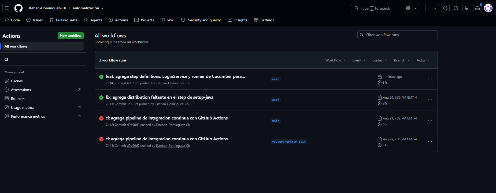
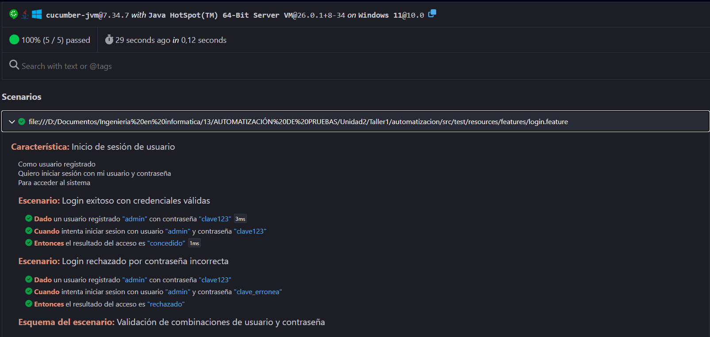
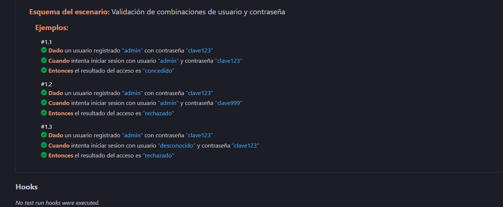
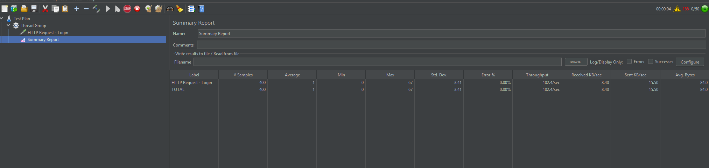

# Automatización de pruebas

Proyecto Maven con pruebas unitarias automatizadas e integración continua.

## ¿Qué es la integración continua (CI)?

La integración continua es una práctica que consiste en integrar frecuentemente los cambios de código en un repositorio compartido. Cada integración dispara automáticamente un pipeline que compila el proyecto, ejecuta las pruebas automatizadas y entrega feedback inmediato al equipo.

**Beneficios:**
- Detecta errores temprano, evitando que se acumulen.
- Da feedback rápido a quien programó el cambio.
- Aumenta la transparencia: todo el equipo ve el estado del proyecto.
- Reduce riesgos y mejora la calidad del software entregado.

**Por qué importan los commits y merges frecuentes:** hacer commits pequeños y seguidos permite que cada cambio se valide por separado, que los conflictos se detecten apenas aparecen (no semanas después) y que quede un historial claro de cómo evolucionó el proyecto.

## Cómo ejecutar el proyecto

```bash
git clone <url-repositorio>
cd automatizacion
mvn install
mvn test
```

## Estructura del proyecto

```
automatizacion/
├── src/main/java/com/automatizacion/    # código de la aplicación
├── src/test/java/com/automatizacion/    # pruebas automatizadas
│   ├── SumaTest.java
│   └── RestaTest.java
├── pom.xml
├── .gitignore
└── README.md
```

## Sobre las pruebas

`SumaTest` y `RestaTest` son pruebas pequeñas y atómicas: cada una verifica un solo comportamiento (una operación aritmética), sin depender de datos externos ni del resultado de otra prueba. Esto facilita detectar errores, mantener el código y ejecutar las pruebas de forma aislada y repetible.

## Limpieza del entorno

El archivo `.gitignore` evita subir archivos temporales y generados (`target/`, `.class`, `.idea/`) al repositorio, manteniendo el proyecto enfocado solo en el código relevante.

## Sesión "Three Amigos" — Funcionalidad de Login

**Participantes:**
- **Negocio (Product Owner):** define qué necesita el usuario.
- **QA:** propone los casos a cubrir.
- **Desarrollo:** aclara cómo se va a implementar.

**Objetivo y alcance de la funcionalidad:** permitir que un usuario ya registrado
inicie sesión con su usuario y contraseña. Fuera de alcance por ahora: recuperación
de contraseña y bloqueo de cuenta por intentos fallidos.

**Discusión:**
- *Negocio:* "El usuario debe poder ingresar con su usuario y contraseña, y si se
  equivoca, el sistema le debe decir que las credenciales son incorrectas, sin
  indicar si fue el usuario o la contraseña la que falló (por seguridad)."
- *QA:* "Hay que cubrir el camino feliz (login correcto), el camino con clave
  incorrecta, y un usuario que no existe. Los tres deberían dar el mismo mensaje
  de error para no filtrar información."
- *Desarrollo:* "Puedo implementar esto con un servicio simple que guarde usuarios
  registrados en memoria y compare usuario/contraseña."

**Criterios de aceptación acordados:**
1. Si el usuario y la contraseña coinciden con un registro existente, el acceso se concede.
2. Si la contraseña no coincide, o el usuario no existe, el acceso se rechaza con el mismo mensaje genérico.

**Ejemplos discutidos:** `admin` con clave correcta (acceso concedido); `admin` con
clave incorrecta (acceso rechazado); `desconocido` con cualquier clave (acceso rechazado).

## Actividad 2 — BDD, performance y observabilidad

### 1. Sesión "Three Amigos"
[ya está documentado en la sección anterior del README]

### 2. Escenarios Gherkin
Ver `src/test/resources/features/login.feature`.

### 3. Step definitions y ejecución
Se agregaron las dependencias `cucumber-java` y `cucumber-junit` (7.34.7) al `pom.xml`,
`LoginService.java` con la lógica de login en memoria, `LoginSteps.java` con los pasos
en español (`@Dado`/`@Cuando`/`@Entonces`), y `RunCucumberTest.java` como runner. Al
correr `mvn test` se ejecutan los 5 escenarios de `login.feature` junto con los tests
unitarios existentes, con resultado BUILD SUCCESS (7/7 tests, 0 fallos).


### 4. Integración en el pipeline de CI
No fue necesario modificar `ci.yml`: al ejecutarse `mvn test`, GitHub Actions corre
automáticamente también los escenarios de Cucumber en cada push.



### 5. Reporte navegable
`RunCucumberTest.java` genera un reporte HTML en `target/cucumber-report.html` en cada
ejecución, con el detalle de cada escenario y paso.




### 6. Prueba de performance
Se expuso el login mediante un servidor HTTP mínimo (`LoginServer.java`, puerto 8080)
y se probó con Apache JMeter: 50 usuarios concurrentes, 10 iteraciones cada uno (500
solicitudes). Resultados: Throughput de 102.4 solicitudes/seg, latencia promedio de
1 ms (máximo puntual de 67 ms en el arranque), y 0.00% de errores.



### 7. Métricas a un dashboard
Se propone integrar Grafana: los resultados de JMeter (JTL) se enviarían a InfluxDB vía
el Backend Listener de JMeter, y los resultados de Cucumber (`cucumber.json`) se
procesarían con `maven-cucumber-reporting`. Un job adicional en GitHub Actions
publicaría estos artefactos hacia Grafana, con paneles de TPS y latencia del login en
el tiempo, porcentaje de escenarios BDD pasados/fallidos por build, y evolución de la
cobertura de tests.

### 8. Alertas automáticas
Si `mvn test` falla (test unitario, escenario Cucumber, o umbral de performance con
`jmeter-maven-plugin`), el job de CI termina en rojo. Se agregaría un step final con
`slackapi/slack-github-action`, condicionado a `if: failure()`, notificando al canal
del equipo con el commit, autor y link al log. Para degradaciones de performance sin
falla total (throughput bajo umbral o latencia sobre cierto valor), se agregaría un
paso que parsee el reporte de JMeter y corte el build si no se cumplen los umbrales.